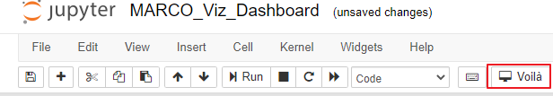

# MARCO_Viz

You can access the dashboard online or locally. For online use, just click the `launch binder` button above. To run it locally, please follow the instructions below

Prerequisites
* repo2docker [Installation Tutorial](https://repo2docker.readthedocs.io/en/latest/install.html)
* docker
* Mac ([Why not Windows](https://github.com/jupyterhub/repo2docker/issues/889) if you stick to Windows, check this [tutorial](https://nickjanetakis.com/blog/setting-up-docker-for-windows-and-wsl-to-work-flawlessly))

Now you can
* clone the repo to your local computer stored under `./path/folder_name`
* simply run `repo2docker ./path/folder_name`
* it might take about 5 mins to build the image, after that, you will see a link start with `http://127.0.0.1:XXXXXXXXXX` and just copy paste it in your browser
* click `MARCO_Viz_Dashboard.ipynb` and then run the extension voila within the toolbar
 
